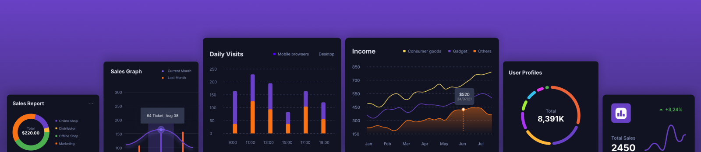

<br />
<div align="center">
<h1>Propel UI Kit</h1>
    <h2> Data visualization and dashboard React components </h2>
  
  <h3 align="center">
    <a href="https://propelify.propeldata.com" target="_blank">Demo Dashboard</a> |&nbsp; 
    <a href="https://storybook.propeldata.com" target="_blank">Storybook</a>
  </h3>
</div>
<br />

The Propel UI Kit is a Data visualization and dashboard React components library to quickly build awesome-looking analytics into your apps.

## Quick Install

To install the Propel UI Kit components, run the following command:

\```shell
npm install @propeldata/react-counter @propeldata/react-time-series @propeldata/react-leaderboard
\```

## Why the Propel UI Kit?

Building data visualization UIs is never easy. Implementing designs from scratch is time-consuming, fetching data requires a lot of backend logic, and there are always a lot of edge cases to deal with, like the intricacies of the different time ranges, or handling the loading and error states.

Charting libraries like Chart.js, ECharts, Highcharts, or D3 are great but still need a lot of work to build them into elegant and cohesive product experiences. On the flip side, embedding third-party chart widgets via iframes into your customer-facing product results in an inflexible, slow, and inelegant product experience.

That's why we built the Propel UI Kit. Its component-based approach allows you to move fast, look great, and focus your efforts on building components that are unique to your product.

### Core principles

The Propel UI Kit is an open-source project built on five core principles:

- **Don't reinvent the wheel.** Charting libraries are great, let's make them better. We built the UI Kit on top of all the power and efficiency of Chart.js.

- **Work and look great out-of-box.** The components work and look great out of the box. You can drop them into your app with minor color customization, and you'll be off to a great start.

- **Extremely customizable.** You can customize their styles, look and feel, and error and loading experience to always feel native to your product.

- **Built in React for React.** We built them in React for React frontends. No cross-framework abstractions and no unnecessary baggage.

- **They work with or without Propel's APIs.** You can use them by themselves in Static mode or with the Propel API in Connected mode.

## Key features

All components share the same set of key features:

- **They are responsive.** Components are responsive out of the box. They render well on desktops and laptops as well as phones and tablets.

- **They handle loading and error states for you.** No need to sweat the details of handling the different states. We've done that for you.

- **They fetch the data for you.** Components can automatically fetch the data from the Propel API when used in connected mode.

Individual components have other key features that we highlight on the component documentation pages.

## Components

Check out the different components and their documentation:

- [Time Series](https://github.com/propeldata/ui-kit/tree/main/packages/react/time-series)
- [Counter](https://github.com/propeldata/ui-kit/tree/main/packages/react/counter)
- [Leaderboard](https://github.com/propeldata/ui-kit/tree/main/packages/react/leaderboard)

Please [open a feature request](https://github.com/propeldata/ui-kit/issues) on GitHub for other components you'd like to have. Also, PRs are welcome 😊.

## Getting Started with Propel

To leverage the full power of Propel UI Kit, you'll need a Propel Account. If you don't have a Propel Account yet, you can [try Propel for free](https://propeldata.com/get-started).

You can learn more about Propel by reading our [API docs](https://propeldata.com/docs).

## Usage

The Propel UI Kit components are available in two modes: "Static" and "Connected".

### Static Mode

In the "Static" mode, the component will display the data you provide.

Let's take our [@propeldata/react-time-series](https://github.com/propeldata/ui-kit/tree/main/packages/react/time-series) component as an example. If you want to fetch the data on your own instead of delegating it to the library, you can do so using the following JavaScript code:

```javascript
import { TimeSeries } from '@propeldata/react-time-series'

const labels = ['Mon', 'Tue', 'Wed', 'Thu', 'Fri', 'Sat', 'Sun']

const values = [0, 1000, 200, 3000, 4000, 500, 7000]

function WeekSalesChart() {
  return <TimeSeries labels={labels} values={values} />
}
```

You can customize the component using your own styles.

<p align="center">
  
</p>

### Connected Mode

In the "Connected" mode, the component automatically fetches the data from the Propel API. You don't need a backend, configure a GraphQL client, or handle loading and error states.

To learn more about querying data with Propel, read the [Metric query documentation](https://www.propeldata.com/docs/metrics).

For the Connected mode, you'll need to provide your Propel Application's access token to use Propel APIs. You can authenticate and generate an access token by following the steps outlined in [the Propel GraphQL Authentication guide](https://propeldata.com/docs/api/authentication#step-2-generate-an-access-token).

Here is an example using our [@propeldata/react-counter](https://github.com/propeldata/ui-kit/tree/main/packages/react/time-series) component:

```javascript
import { Counter } from '@propeldata/react-counter'

function SalesCountLabel() {
  const queryOptions = {
    accessToken: '<PROPEL_ACCESS_TOKEN>',
    metric: 'salesCount',
    timeRange: {
      relative: 'PREVIOUS_WEEK'
    },
    granularity: 'DAY'
  }

  return (
    <p>
      We reached <Counter query={queryOptions} /> last week.
    </p>
  )
}
```

In this mode, the component will handle the loading and error states for you, making it even easier to use.

<p align="center">
  
</p>

Want to see more examples? Check out our [Storybook](https://storybook.propeldata.com)!

## Customization: Making It Your Own

We designed the Propel UI Kit to be highly customizable and easy to incorporate into your front-end applications. Here are some of the customization options available to you:

### Styles

You can apply your own custom styles to each component using the Styles interface. This interface includes a wide range of properties to customize your charts, such as font, canvas, tooltip, bar, line, and point.

For example, to change the color of the bars in your time series chart, you can use the following JavaScript code:

```javascript
function MyChart() {
  // source code

  const styles = {
    bar: {
      backgroundColor: '#532AB4'
    }
  }

  return <TimeSeries styles={styles} />
}
```

This will change the color of the bars to a shade of purple, as shown in the following image:

<p align="center">
  
</p>

### Errors

You can also provide your own custom error messages by using the error prop. This will enable you to provide more accurate feedback to your users in case of technical errors or other issues.

For example, to display a custom error message when the chart data cannot be loaded, you can use the following JavaScript code:

```javascript
function MyChart() {
  // source code

  const title = 'Unable to connect'
  const body = 'Sorry we are not able to connect at this time due to a technical error.'

  return <TimeSeries error={{ title, body }} />
}
```

This will display a custom error message with a title and body text, as shown in the following image:

<p align="center">
  
</p>

By customizing your Propel UI Kit components in this way, you can create unique, user-friendly data visualizations that fit seamlessly into your front-end applications.

## Contributing

If you notice any bugs or have suggestions for new features, please [open an issue](https://github.com/propeldata/ui-kit/issues) on GitHub. We welcome feedback and contributions from the community!

## License

MIT License

---

Made with 💜 and [Chart.js](https://www.chartjs.org/). Powered by [Propel](https://www.propeldata.com)! 🚀
