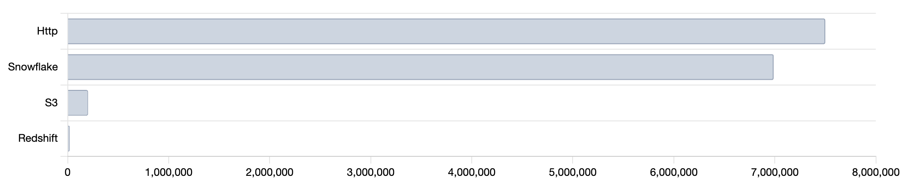
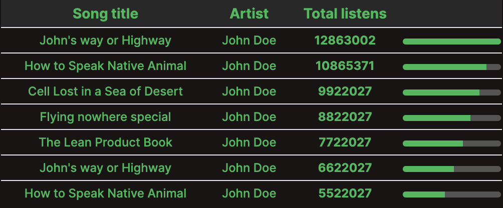

# Leaderboard

The Leaderboard component is designed to create Propel leaderboard metric visualizations for your front-end applications. With two props in Static mode, `headers` and `rows`, the Leaderboard component provides a simple way to display your data. If you opt for the Connected mode, the component will accept the query prop, which loads the data automatically based on [Propel specifications](https://studio.apollographql.com/graph/Propel-API/schema/reference/inputs/LeaderboardInput?variant=production).

## Installation

To install the Leaderboard component in your project, use your preferred package manager and run the following command:

With `yarn`:

```shell
yarn add @propeldata/ui-kit
```

or `npm`:

```shell
npm install @propeldata/ui-kit
```

This will add the component to your `node_modules` folder. You can then import the component in your `React` file and use it as shown in the following example:

```javascript
import { Leaderboard } from '@propeldata/ui-kit'

function MonthSalesChart() {
  const queryOptions = {
    accessToken: '<PROPEL_ACCESS_TOKEN>',
    metric: 'syncRecordsAdded',
    timeRange: {
      relative: RelativeTimeRange.LastNDays,
      n: 30
    },
    rowLimit: 10,
    dimensions: [
      {
        columnName: 'DATA_SOURCE_TYPE'
      }
    ],
    sort: Sort.Desc
  }
  return <Leaderboard query={queryOptions} />
}
```

This will generate a leaderboard chart as shown below:

<p align="center">
  
</p>

As you can see, the chart comes with a set of basic styles. However, you can customize it to your liking. Let's build a totally different leaderboard chart now. Here's how you can access the style props:

```javascript
function CustomChart() {
  const styles = {
    font: {
      color: '#1DB954'
    },
    table: {
      stickyHeader: true,
      height: '200px',
      hasValueBar: true,
      backgroundColor: '#191414',
      header: {
        backgroundColor: '#282828',
        font: {
          weight: 'bold',
          size: '14px'
        }
      },
      valueBar: {
        backgroundColor: '#545454'
      },
      valueColumn: {
        align: 'center'
      },
      columns: {
        align: 'center'
      }
    }
  }

  return <Leaderboard styles={styles} variant="table" />
}
```

<p align="center">
  
</p>

In this example, we built a detailed table chart where you could use on small viewports or in a mobile design maybe. Up to you! You can adjust these and other style properties to create a unique look for your leaderboard chart.

Now let's look at what all you can do with the component. The next 2 topics will cover all the props and styles you can configure to have a nice chart experience

## Props API

The following table describes the props available for the Leaderboard component:

| **Name** | **Type**                  | **Required**                                       | **Default**        | **Description**                                                                          |
| -------- | ------------------------- | -------------------------------------------------- | ------------------ | ---------------------------------------------------------------------------------------- |
| variant  | `LeaderboardChartVariant` | **No**                                             | `"bar"`            | The variant the chart will respond to, can be either `bar` or `table`                    |
| styles   | `ChartStyles`             | **No**                                             | _See next section_ | Check the styles table below for more information                                        |
| headers  | `Array<string>`           | **Yes** _If `query` is not provided_               | `undefined`        | If passed along with `rows` the component will ignore the built-in graphql operations    |
| rows     | `Array<string>`           | **Yes** _If `query` is not provided_               | `undefined`        | If passed along with `headers` the component will ignore the built-in graphql operations |
| loading  | `boolean`                 | **No**                                             | `false`            | When true, shows a skeleton loader                                                       |
| query    | _check query table below_ | **Yes** _If `headers` and `rows` are not provided_ | `undefined`        | Check the query sub props table below                                                    |

### `query` sub props

| **Name**    | **Type**                                                                                                                             | **Required** | **Default** | **Description**                                                                  |
| ----------- | ------------------------------------------------------------------------------------------------------------------------------------ | ------------ | ----------- | -------------------------------------------------------------------------------- |
| accessToken | `string`                                                                                                                             | **Yes**      | `undefined` | You account's access token                                                       |
| metric      | `string`                                                                                                                             | **Yes**      | `undefined` | Metric unique name                                                               |
| timeRange   | [TimeRangeInput](https://studio.apollographql.com/graph/Propel-API/schema/reference/inputs/TimeRangeInput?variant=production)        | **Yes**      | `undefined` | Time range that the chart will respond to                                        |
| filters     | Array<[FilterInput](https://studio.apollographql.com/graph/Propel-API/schema/reference/inputs/FilterInput?variant=production)>       | **No**       | `undefined` | Filters that the chart will respond to                                           |
| propeller   | [Propeller](https://studio.apollographql.com/graph/Propel-API/schema/reference/enums/Propeller?variant=production)                   | **No**       | `undefined` | Propeller that the chart will respond to                                         |
| rowLimit    | `number`                                                                                                                             | **Yes**      | `undefined` | The number of rows to be returned. It can be a number between 1 and 1,000        |
| sort        | `Sort`                                                                                                                               | **No**       | `'DESC'`    | The sort order of the rows. It can be ascending (ASC) or descending (DESC) order |
| dimensions  | Array<[DimensionInput](https://studio.apollographql.com/graph/Propel-API/schema/reference/inputs/DimensionInput?variant=production)> | **Yes**      | `undefined` | One or many Dimensions to group the Metric values by                             |

## Styles API

The `styles` prop allows you to customize the appearance of the chart. It accepts an object of style options, conforming to the `Styles` interface. Below is a table detailing the different options available:

| Prop Name | Type            | Description                                                   |
| --------- | --------------- | ------------------------------------------------------------- |
| font      | `FontStyles`    | Styles for the font used in the component                     |
| canvas    | `CanvasStyles`  | Styles for the canvas used in the component                   |
| tooltip   | `TooltipStyles` | Styles for the tooltip displayed on hover                     |
| bar       | `BarStyles`     | Styles for the bars in the chart (only used in `bar` variant) |
| table     | `TableStyles`   | Styles for the table chart (only used in `table` variant)     |

### FontStyles

| Prop Name  | Type                                                             | Default   | Description                 |
| ---------- | ---------------------------------------------------------------- | --------- | --------------------------- |
| color      | `string`                                                         | `inherit` | The color of the font       |
| family     | `string`                                                         | `inherit` | The font family to use      |
| size       | `number`                                                         | `inherit` | The size of the font        |
| style      | `'normal'`, `'italic'`, `'oblique'`, `'initial'`, or `'inherit'` | `inherit` | The style of the font       |
| weight     | `string`                                                         | `inherit` | The weight of the font      |
| lineHeight | `number` or `string`                                             | `inherit` | The line height of the font |

### CanvasStyles

| Prop Name       | Type                  | Default                                                         | Description                             |
| --------------- | --------------------- | --------------------------------------------------------------- | --------------------------------------- |
| width           | `number`              | If `undefined` it will take `"100%"` of the parent element size | The width of the canvas in `px`         |
| height          | `number`              | `200`                                                           | The height of the canvas in `px`        |
| hideGridLines   | `boolean`             | `false`                                                         | Whether to hide the grid lines          |
| backgroundColor | `string`              | `"#ffffff"`                                                     | The background color of the canvas      |
| padding         | `ChartPaddingOptions` | `12`                                                            | The padding of the canvas in `px`       |
| borderRadius    | `string`              | `"0px"`                                                         | The border radius of the canvas in `px` |

## Tooltip Styles

| Prop Name       | Type                               | Default     | Description                                  |
| --------------- | ---------------------------------- | ----------- | -------------------------------------------- |
| display         | `boolean`                          | `true`      | Whether to show the tooltip or not.          |
| backgroundColor | `string`                           | `"#ffffff"` | Background color of the tooltip.             |
| borderRadius    | `number`                           | `6`         | Border radius of the tooltip in `px`.        |
| borderColor     | `string`                           | `"#000"`    | Border color of the tooltip.                 |
| borderWidth     | `number`                           | `2`         | Border width of the tooltip in `px`.         |
| color           | `string`                           | `"#000"`    | Text color of the tooltip.                   |
| padding         | `number`                           | `8`         | Padding of the tooltip in `px`.              |
| alignContent    | `"left"`, `"center"`, or `"right"` | `"left"`    | Alignment of the content inside the tooltip. |
| caretSize       | `number`                           | `2`         | Size of the tooltip's caret in `px`.         |

## Bar Styles

| Prop Name            | Type     | Default     | Description                            |
| -------------------- | -------- | ----------- | -------------------------------------- |
| thickness            | `number` | `20`        | Thickness of the bars in `px`.         |
| borderWidth          | `number` | `1`         | Border width of the bars in `px`.      |
| borderRadius         | `number` | `2`         | Border radius of the bars in `px`.     |
| borderColor          | `string` | `"#94A3B8"` | Border color of the bars.              |
| hoverBorderColor     | `string` | `"#64748B"` | Border color of the bars on hover.     |
| backgroundColor      | `string` | `"#CBD5E1"` | Background color of the bars.          |
| hoverBackgroundColor | `string` | `"#64748B"` | Background color of the bars on hover. |

## Table Styles

| Prop Name       | Type                | Default                         | Description                                                   |
| --------------- | ------------------- | ------------------------------- | ------------------------------------------------------------- |
| width           | `string`            | '100%'                          | The width of the table.                                       |
| height          | `string`            | '100%'                          | The height of the table.                                      |
| stickyHeader    | `boolean`           | false                           | Whether the table header should remain fixed while scrolling. |
| isOrdered       | `boolean`           | false                           | Whether the table shows number order.                         |
| hasValueBar     | `boolean`           | false                           | Whether the table shows a value bar.                          |
| backgroundColor | `string`            | '#FFFFFF'                       | The background color of the table.                            |
| padding         | `string`            | '5px'                           | The padding of the table.                                     |
| header          | `HeaderStyles`      | _check HeaderStyles table_      | The styles for the table header.                              |
| columns         | `ColumnStyles`      | _check ColumnStyles table_      | The styles for the table columns.                             |
| valueColumn     | `ValueColumnStyles` | _check ValueColumnStyles table_ | The styles for the table value column.                        |
| valueBar        | `ValueBarStyles`    | _check ValueBarStyles table_    | The styles for the table value bar.                           |

## HeaderStyles

| Prop Name       | Type         | Default                  | Description                          |
| --------------- | ------------ | ------------------------ | ------------------------------------ |
| backgroundColor | `string`     | `'#FFFFFF'`              | The background color of the header.  |
| align           | `string`     | `'left'`                 | The alignment of the header text.    |
| font            | `FontStyles` | _check FontStyles table_ | The font styles for the header text. |

## ColumnStyles

| Prop Name       | Type         | Default                  | Description                          |
| --------------- | ------------ | ------------------------ | ------------------------------------ |
| backgroundColor | `string`     | `'#FFFFFF'`              | The background color of the columns. |
| align           | `string`     | `'left'`                 | The alignment of the column text.    |
| font            | `FontStyles` | _check FontStyles table_ | The font styles for the column text. |

## ValueColumnStyles

| Prop Name       | Type         | Default                  | Description                                            |
| --------------- | ------------ | ------------------------ | ------------------------------------------------------ |
| locale          | `boolean`    | `false`                  | Whether the value column should use the locale format. |
| backgroundColor | `string`     | `'#FFFFFF'`              | The background color of the value column.              |
| align           | `string`     | `'right'`                | The alignment of the value column text.                |
| font            | `FontStyles` | _check FontStyles table_ | The font styles for the value column text.             |

## FontStyles

| Prop Name  | Type                                                             | Default   | Description                 |
| ---------- | ---------------------------------------------------------------- | --------- | --------------------------- |
| color      | `string`                                                         | `inherit` | The color of the font       |
| family     | `string`                                                         | `inherit` | The font family to use      |
| size       | `number`                                                         | `inherit` | The size of the font        |
| style      | `'normal'`, `'italic'`, `'oblique'`, `'initial'`, or `'inherit'` | `inherit` | The style of the font       |
| weight     | `string`                                                         | `inherit` | The weight of the font      |
| lineHeight | `number` or `string`                                             | `inherit` | The line height of the font |
